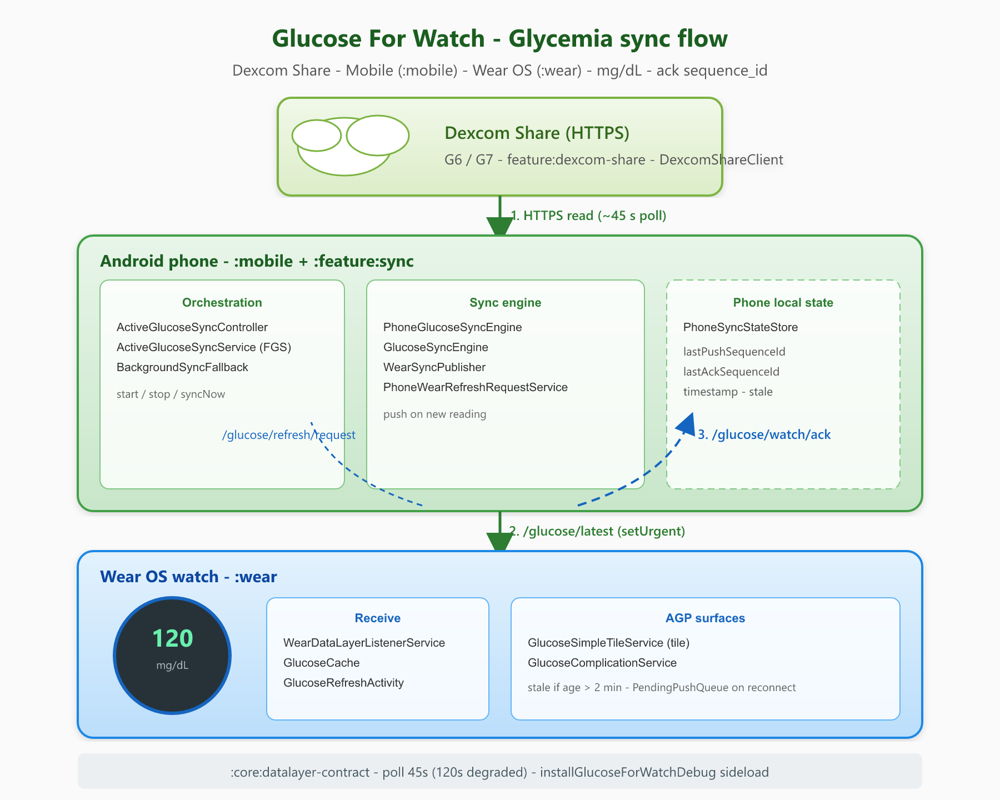

# Glucose For Watch

<p align="center">
  
  
  
  
  
  
</p>

**Glucose For Watch** is a companion app (**Android phone + Wear OS**) that syncs **Dexcom Share** glucose readings to your watch for at-a-glance display via the **app**, **tile**, and **complication**.

> GitHub: [`ToXY0392/Glucose-For-Watch`](https://github.com/ToXY0392/Glucose-For-Watch) · Package: `com.glucoseforwatch.*` · Install task: `installGlucoseForWatchDebug`

<p align="center">
  
</p>

## What it does

| Surface | Role |
|---------|------|
| **Phone** | Dexcom Share auth, foreground sync, notifications, Wear installer |
| **Wear app** | Latest reading + sync status |
| **Tile** | ProtoLayout glanceable glucose + sync action |
| **Complication** | Watch-face short / long / ranged values |

**Sensors:** Dexcom **G6** and **G7** Share — see [docs/guide/dexcom.md](docs/guide/dexcom.md).

## Tech stack

| Layer | Choice |
|-------|--------|
| Language | **Kotlin** 2.3.20 |
| UI (phone) | **Jetpack Compose** Material 3 |
| UI (wear) | Wear Compose + **ProtoLayout / Tiles** + complications |
| Sync | Wearable **Data Layer**, ack-based delivery |
| Background | **Foreground Service** (`dataSync`) + **WorkManager** fallback + alarms |
| Build | AGP **9.3**, Gradle **9.5**, `compileSdk` / `targetSdk` **36** |
| Design | ToXY UX kit chrome + **AGP** medical colors for glucose |

Architecture deep-dive: [docs/dev/architecture.md](docs/dev/architecture.md).

## Prerequisites

- Android Studio (recent stable)
- JDK **17+** (JBR 21 recommended for IDE)
- Android SDK with API **36**
- Phone + Wear OS watch (USB / wireless adb) for device installs

Full environment notes: [docs/dev/setup.md](docs/dev/setup.md).

## Quick start (local build)

1. Clone and configure `local.properties` (**never commit** this file):

```properties
sdk.dir=/path/to/Android/sdk
gfw.adb.phone.serial=<adb_phone_serial>
gfw.adb.watch.serial=<adb_watch_serial>
```

2. Assemble debug APKs:

```powershell
.\gradlew.bat :mobile:assembleDebug :wear:assembleDebug
```

```bash
./gradlew :mobile:assembleDebug :wear:assembleDebug
```

3. Install on phone **and** watch in one step:

```powershell
.\gradlew.bat installGlucoseForWatchDebug
```

```bash
./gradlew installGlucoseForWatchDebug
```

4. Open the phone app → accept legal screens → connect Dexcom Share → **Sync** → add the Wear **tile** / **complication**.

User walkthrough: [docs/guide/user.md](docs/guide/user.md).

## Repository layout

```
mobile/          Phone app (Compose)
wear/            Wear OS app (tile, complication, UI)
core/            Shared model + Data Layer contract
feature/         sync, dexcom-share, watch-install
toxy-ux-kit/     Design tokens / AGP palette export
docs/            Guides, architecture, QA, plan
scripts/         Dev + QA automation
```

## Contributing

1. Branch from `develop/integration` using `{feat|fix|docs|…}/bloc-…` or a `sandbox/*` lane.
2. Open a PR **into `develop/integration`** (releases promote to `main`).
3. Follow [.github/pull_request_template.md](.github/pull_request_template.md) and [docs/plan/PR-CHECKLIST.md](docs/plan/PR-CHECKLIST.md).

Agent / workspace guide: [AGENTS.md](AGENTS.md) · [CONTRIBUTING.md](CONTRIBUTING.md).

## Documentation hub

**[docs/index.md](docs/index.md)**

## Security

- Never commit Dexcom credentials, real glucose values, or `local.properties`
- Never commit keystores (`*.jks`, `*.keystore`) or signing secrets
- Use `gradle.properties.example` as a template only

## Medical disclaimer

Glucose For Watch is **not** a certified medical device. See [docs/legal/medical-disclaimer.md](docs/legal/medical-disclaimer.md).

## License

See the repository license file (if applicable).

---

Built to keep glucose visible on Wear OS with a simple, traceable, and robust sync flow.
