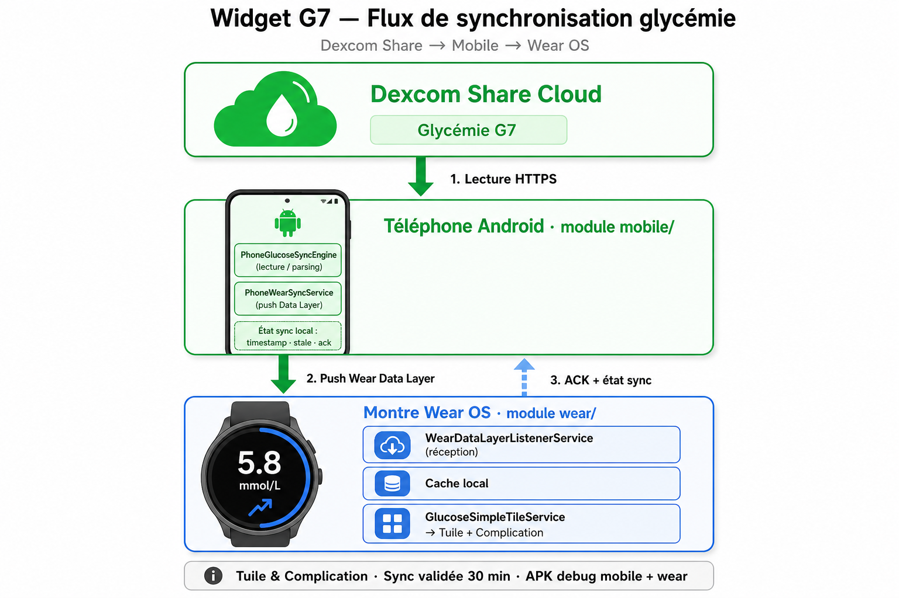

# ToXY

ToXY syncs Dexcom glucose data to Wear OS for fast at-a-glance display on your watch (app, tile, and complication). The app uses the **ToXY** design system with **AGP-standard medical colors** for all glucose values.

> Repository folder remains `Widget G7` for compatibility; Gradle task `installWidgetG7Debug` unchanged.

<p align="center">
  
  
  
  
</p>

<p align="center">
  
</p>

## Overview

This project:

- Fetches the latest glucose reading via **Dexcom Share** on the phone
- Pushes data to the watch through the **Wear Data Layer**
- Updates the **tile** and **complication**
- Tracks sync health (ack, timestamp, stale state) for diagnostics

**Supported sensors:** Dexcom **G6** and **G7** when Dexcom Share is enabled on the account (same Share API — see [compatibility doc](docs/compatibility/dexcom-g6-g7.md)).

## Highlights

- Modular sync engine with hexagonal ports (`GlucoseSyncEngine`)
- Ack-based delivery verification between phone and watch
- AGP / Time-in-Range color coding for glucose values (medical standard)
- Separate mobile and wear APKs with embedded wear install flow (debug)

## Architecture

| Module | Role |
|--------|------|
| `mobile/` | Dexcom fetch, sync orchestration, phone UI |
| `wear/` | Watch cache, tile, complication, Data Layer listener |
| `core/` | Shared models and Data Layer contract |
| `feature/` | Sync engine, Dexcom Share client, watch install |

See [Architecture overview](docs/architecture/overview.md) and [Sync pipeline](docs/architecture/sync-pipeline.md).

## Prerequisites

- Android Studio (recent) — see [Android Studio guide](docs/development/android-studio.md)
- Gradle wrapper **9.4.1** (AGP **9.2.1**, Kotlin **2.3.20**)
- JDK **JBR 21** (Android Studio bundled)
- Android SDK with `compileSdk 36` (`local.properties` → `sdk.dir`)
- One Android phone + one Wear OS watch for real-device testing

## Quick start

1. Install `mobile-debug.apk` on the phone.
2. Install `wear-debug.apk` on the watch.
3. Open ToXY on the phone.
4. Accept legal screens.
5. Connect Dexcom Share credentials.
6. Run a sync test from the phone home screen.
7. Add the ToXY tile or complication on the watch.

Detailed steps: [User quick start](docs/user/quick-start.md).

## Build

```powershell
.\gradlew.bat help
.\gradlew.bat :mobile:assembleDebug :wear:assembleDebug
```

Output APKs:

- `mobile/build/outputs/apk/debug/mobile-debug.apk`
- `wear/build/outputs/apk/debug/wear-debug.apk`

Install both (requires `local.properties` serials):

```powershell
.\gradlew.bat installWidgetG7Debug
```

## Troubleshooting

| Symptom | Action |
|---------|--------|
| Gradle IDE sync fails but terminal works | Check JBR path in `gradle.properties`; see [environment](docs/compatibility/environment.md) |
| Watch value frozen | Force sync from phone; see [troubleshooting](docs/user/troubleshooting.md) |
| Complication shows old value | Remove and re-add complication on watch face |
| Watch was offline | Data catches up on reconnect; keep phone app running |

## Documentation

**[docs/index.md](docs/index.md)** · **Suivi plan : [docs/plan/PROGRESS.md](docs/plan/PROGRESS.md)** · [Plan maître](docs/plan/MASTER-REFACTOR-PLAN.md) · Design : [toxy-ux-kit/](toxy-ux-kit/README.md)

## Contributing

See [CONTRIBUTING.md](CONTRIBUTING.md). Every sync-related PR must include a manual phone↔watch test note.

## Security

- Never commit Dexcom credentials or real glucose data
- Never commit `local.properties`, keystores, or secrets
- Use `gradle.properties.example` as template only

## Medical disclaimer

Widget G7 is **not** a certified medical device. Displayed data is informational only. All treatment decisions must be confirmed using an official Dexcom solution. See [medical disclaimer](docs/legal/medical-disclaimer.md).

## License

See repository license file (if applicable).

---

Developed to keep glucose visible on Wear OS with a simple, traceable, and robust sync flow.
