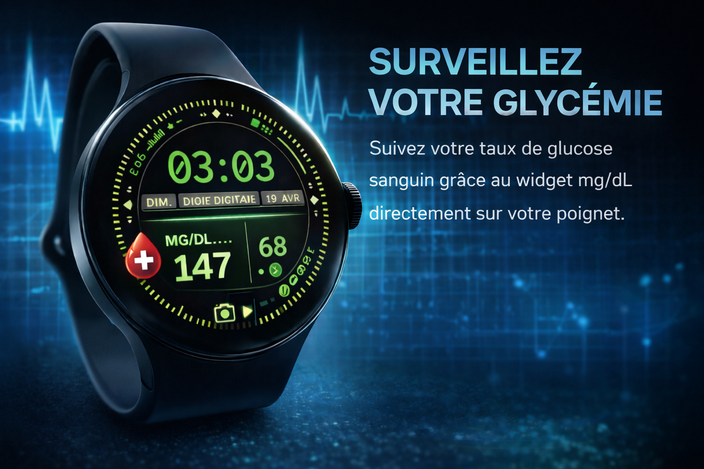

# Widget G7 - Phone + Wear OS

Companion app Android + Wear OS pour afficher une glycemie Dexcom G7 sur telephone, tile montre et complication de cadran.

## Apercu



## Etat actuel

- lecture Dexcom Share fonctionnelle sur le telephone
- sync telephone -> montre via Wear Data Layer fonctionnelle
- tile montre fonctionnel
- complication de cadran fonctionnelle, mais le rendu depend du slot et du cadran utilises
- auto-sync telephone configure a `2 min`

## Fonctionnement

1. le module `mobile` lit la derniere mesure glucose
2. il pousse la mesure vers la montre via `/glucose/latest`
3. le module `wear` recoit la donnee et la met en cache
4. le tile et la complication lisent ce cache local

## Documentation

- compatibilite Android : [COMPATIBILITY.md](<C:/Users/Utilisateur/Desktop/THP/Projects/Widget G7/COMPATIBILITY.md>)

## Structure

- `mobile` : source glucose + sync vers la montre
- `wear` : listener Data Layer + cache + complication + tile

## Sources supportees

Le module `mobile` choisit automatiquement la source dans cet ordre :

1. `DexcomSharePhoneGlucoseSource` si Dexcom Share est configure
2. `RelayPhoneGlucoseSource` si `relayBaseUrl` est configure
3. `DemoPhoneGlucoseSource` sinon

## Payload Data Layer

- `valueMgDl` (Int)
- `trend` (String: `UP`, `UP_RIGHT`, `FLAT`, `DOWN_RIGHT`, `DOWN`)
- `deltaMgDl` (Int)
- `timestampEpochMs` (Long)
- `stale` (Boolean)

## Dexcom Share

### Configuration

Dans `~/.gradle/gradle.properties` ou dans `gradle.properties` projet.
Un exemple publiable sans secrets est fourni dans `gradle.properties.example`.

```properties
dexcomShareUsername=ton_email_ou_identifiant
dexcomSharePassword=ton_mot_de_passe
dexcomShareServer=OUS
dexcomShareApplicationId=d89443d2-327c-4a6f-89e5-496bbb0317db
```

Notes :

- utiliser `OUS` pour un compte Europe / hors US
- utiliser `US` pour un compte americain
- l'application id Dexcom Share reste fixe

## Relay backend

Si Dexcom Share n'est pas configure, le module `mobile` peut utiliser un backend relay.

### Configuration

Dans `~/.gradle/gradle.properties` ou dans `gradle.properties` projet.
Un exemple publiable sans secrets est fourni dans `gradle.properties.example`.

```properties
relayBaseUrl=https://ton-backend.example
relayBearerToken=ton_token_si_necessaire
```

### Contrat endpoint attendu

GET `${relayBaseUrl}/latest-glucose`

Headers :

- `Accept: application/json`
- `Authorization: Bearer <token>` si token non vide

JSON accepte :

```json
{
  "valueMgDl": 128,
  "trend": "UP_RIGHT",
  "deltaMgDl": 4,
  "timestampEpochMs": 1713350000000,
  "stale": false
}
```

Variantes supportees :

- `value_mg_dl`, `value`, `mgdl`
- `delta_mg_dl`, `delta`
- `timestamp_epoch_ms`, `timestamp`, `ts`
- `isStale`, `is_stale`

## Affichage montre

### Tile

Le tile montre utilise actuellement une version semantique simple :

- glycémie en tres grand
- `mg/dL` + fleche sur une ligne secondaire
- code couleur selon l'etat
- pas de graphe

### Regles semantiques

- `normal` : `80..180`
- `attention` : `70..79` ou `181..250`
- `alerte` : `< 70` ou `> 250`
- `stale` : donnees perimees

### Complication de cadran

La complication suit la meme logique semantique :

- la valeur glucose reste toujours l'element le plus visible
- les metadonnees restent secondaires
- support `SHORT_TEXT` et `LONG_TEXT`

Important :

- selon le cadran choisi, certains slots acceptent mieux la complication que d'autres
- en pratique, il faut privilegier un slot texte principal plutot qu'un micro-slot decoratif

## Auto-sync

- l'app telephone planifie une synchro automatique toutes les `2 minutes`
- le bouton `SYNC NOW` reste disponible pour forcer un refresh immediat

## Installation rapide

1. ouvrir le projet dans Android Studio
2. laisser Gradle sync
3. installer `mobile` sur le telephone
4. installer `wear` sur la montre
5. ouvrir l'app telephone
6. appuyer une fois sur `SYNC NOW`
7. ajouter le tile `Glucose Tile` sur la montre
8. ajouter la complication `Glucose` sur un slot texte principal du cadran si besoin

## Notes utiles

- le tile est aujourd'hui la surface la plus stable pour verifier la synchro
- si la complication disparait au retour sur le cadran, le probleme vient souvent du slot ou du type de complication accepte par ce cadran
- la chaine principale `telephone -> Data Layer -> montre` est validee quand le tile se met a jour
