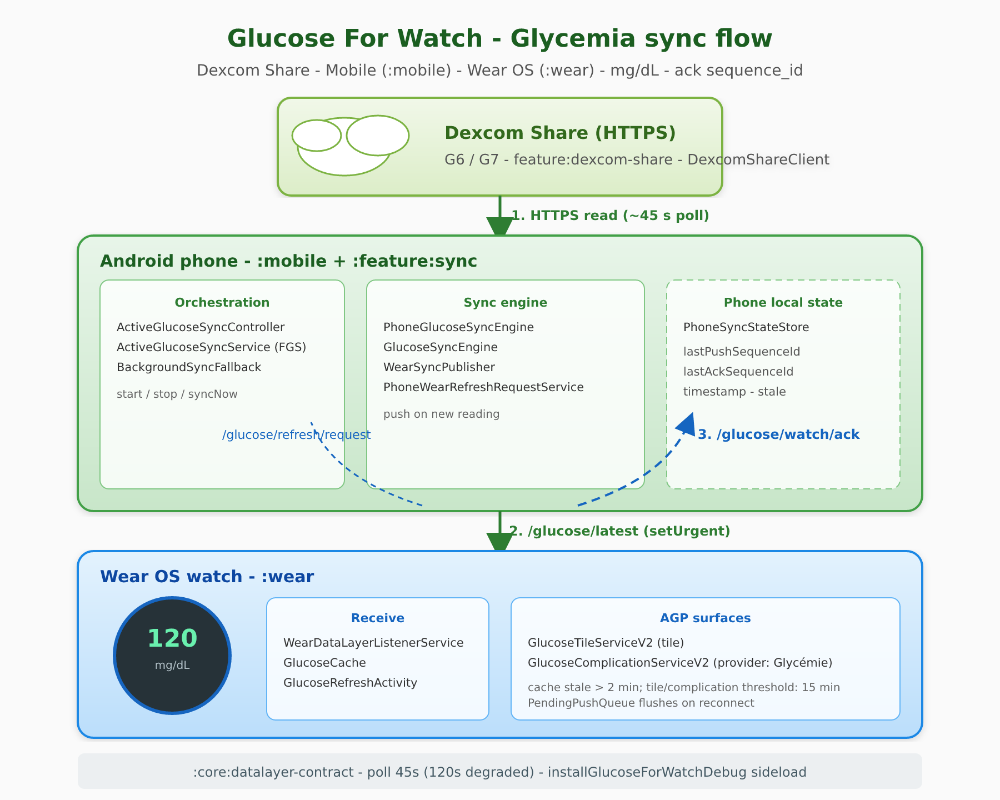

# Glucose For Watch

<p align="center">
  
  
  
  
  
</p>

**Glucose For Watch** is a companion app for Android phones and Wear OS watches. The phone retrieves glucose readings through the **Dexcom Share** service and sends them to the paired watch for display in the Wear app, tile, and complication.

> GitHub: [`ToXY0392/Glucose-For-Watch`](https://github.com/ToXY0392/Glucose-For-Watch) · Application ID: `com.glucoseforwatch.mobile` (phone and Wear APKs) · Local install task: `installGlucoseForWatchDebug`

<p align="center">
  
</p>

## What the app does

| Surface | Responsibility |
|---------|----------------|
| **Phone** | Dexcom Share authentication and fetch, sync orchestration, status and notifications |
| **Wear app** | Displays the latest reading and sync status |
| **Tile** | ProtoLayout glanceable glucose display and refresh action |
| **Complication** | Short, long, and ranged glucose values for compatible watch faces |

**Supported source:** Dexcom G6/G7 through Share. This app does not connect directly to a sensor over Bluetooth. See [docs/guide/dexcom.md](docs/guide/dexcom.md).

## Architecture and sync behavior

1. The phone fetches the latest reading from Dexcom Share.
2. `GlucoseSyncEngine` determines whether it should be delivered.
3. `WearSyncPublisher` writes `/glucose/latest` through the Google Play Services Wearable Data Layer.
4. The watch caches the reading and refreshes its tile and complication.
5. The watch sends an application-level acknowledgement at `/glucose/watch/ack`.
6. The phone records the acknowledgement and can retry an unacknowledged delivery.

### Cancellation, timeouts, and service lifecycle

- `PhoneGlucoseSyncEngine` rethrows `CancellationException` rather than recording normal coroutine cancellation as a sync failure. Its own operation timeouts are handled as sync failures; cancellation of the calling job is propagated.
- `ActiveGlucoseSyncService.repairUnackedDelivery()` limits each Wear push attempt to **8 seconds**. A timed-out attempt is logged and treated as a failed delivery attempt; service/job cancellation is rethrown. This bounds a push wait, not the total time spent in the existing ACK retry delays.
- Immediate sync requests are tracked by `immediateSyncJob`; a newer immediate request cancels the preceding one. Sync passes use `syncMutex` so their protected work is serialized.
- `onDestroy()` cancels `loopJob`, `immediateSyncJob`, and the service-owned parent `serviceJob` (which owns `serviceScope`). The normal stop action cancels the loop and pending immediate job; scope teardown occurs when the service is destroyed.
- A successful Data Layer `putDataItem` is not the same as the watch application acknowledging receipt. The `/glucose/watch/ack` message is the application-level confirmation.
- Active sync retries failures with exponential backoff, starting at 15 seconds and capped at 5 minutes. The interrupted-sync notification is gated by the existing consecutive-failure policy.

Architecture details and protocol paths: [docs/dev/architecture.md](docs/dev/architecture.md).

## Technology stack

| Layer | Current project configuration |
|-------|-------------------------------|
| Language | Kotlin **2.3.20** |
| Phone UI | Jetpack Compose Material 3 |
| Wear UI | Wear Compose, ProtoLayout Tiles, complications |
| Phone-to-watch transport | Google Play Services Wearable Data Layer |
| Background sync | Foreground service (`dataSync`), WorkManager fallback, scheduled alarms |
| Android Gradle Plugin | **9.3.3** |
| Gradle wrapper | **9.6.1** |
| Java | **17** source/target; JBR 21 recommended for Android Studio |
| `compileSdk` / `targetSdk` | **36** for both `:mobile` and `:wear` |
| Minimum SDK | Phone: **28** · Wear: **30** |

## Android 17 readiness and system requirements

Android 17 is **API level 37**. The repository currently builds and targets API **36**; it has **not** yet been migrated to `compileSdk = 37` / `targetSdk = 37`, nor certified against Android 17 behavior changes. Do not read the Android 17 badge as a claim that the current APK targets API 37.

To build against the current project configuration, install Android SDK Platform 36 and a compatible Android Studio/AGP toolchain. To start an Android 17 migration or compatibility test, install the Android 17 SDK Platform and Build Tools 37, then update and validate the project configuration deliberately; simply installing the preview SDK does not change the APK's target API.

When evaluating Android 17:

- Test on an Android 17 API 37 emulator/device and review both changes affecting all apps and changes gated on `targetSdk = 37`.
- Android 17 introduces a runtime `ACCESS_LOCAL_NETWORK` permission for apps targeting API 37 that access local-network devices. The current phone-to-watch transport is the Wearable Data Layer, not an app-managed LAN socket; reassess if a local-network feature or library is added.
- Android 17 documents Encrypted Client Hello (ECH) behavior for apps targeting API 37. Validate the actual HTTP stack and Dexcom endpoint compatibility as part of a target-37 migration; do not assume a library negotiates ECH merely because the OS supports it.
- Existing foreground-service requirements still apply: declare the service type and its corresponding permission, provide the required foreground notification, and handle background-start restrictions. This app declares a `dataSync` foreground service and has a fallback path when Android rejects a foreground-service start.
- Android 12+ restricts starting foreground services from the background except for defined exemptions. Android 14+ checks the declared foreground-service type and permissions. Test the app's actual entry points and fallback behavior rather than relying on an unrestricted background start.
- On Android 13+, notification permission is runtime-controlled. The app's notification and alert behavior depends on the user granting notification permission and enabling the relevant notification channels.
- For continuous Bluetooth CGM acquisition, Android permission and battery guidance depends on the CGM implementation. This app uses Dexcom Share over the network and does not require direct sensor BLE permissions.

Official references: [Android 17 SDK setup](https://developer.android.com/about/versions/17/setup-sdk) · [Android 17 behavior changes](https://developer.android.com/about/versions/17/behavior-changes-17) · [Android 17 changes affecting all apps](https://developer.android.com/about/versions/17/behavior-changes-all) · [Foreground services](https://developer.android.com/develop/background-work/services/fgs) · [Foreground-service background-start restrictions](https://developer.android.com/develop/background-work/services/fgs/restrictions-bg-start) · [Notification runtime permission](https://developer.android.com/develop/ui/views/notifications/notification-permission).

## Prerequisites

- Recent Android Studio compatible with the project's AGP version
- JDK **17+** (Android Studio's embedded JBR 21 is recommended)
- Android SDK Platform **36** and matching build tools for the current project
- For device install: an Android phone and paired Wear OS watch connected by USB or wireless ADB

For detailed environment instructions, see [docs/dev/setup.md](docs/dev/setup.md).

## Build, test, and install

Clone the repository and create a local `local.properties` file (do not commit it):

```properties
sdk.dir=/path/to/Android/sdk
gfw.adb.phone.serial=<adb_phone_serial>
gfw.adb.watch.serial=<adb_watch_serial>
```

List connected devices with `adb devices -l`, then assemble both APKs:

```powershell
.\gradlew.bat :mobile:assembleDebug :wear:assembleDebug
```

```bash
./gradlew :mobile:assembleDebug :wear:assembleDebug
```

Run the unit-test suite:

```powershell
.\gradlew.bat test
```

```bash
./gradlew test
```

Install the matching phone APK on the configured phone and Wear APK on the configured watch:

```powershell
.\gradlew.bat installGlucoseForWatchDebug
```

```bash
./gradlew installGlucoseForWatchDebug
```

The install task requires both ADB serials and installs to **both** configured devices. It does not uninstall existing applications. Do not use it when only one device is intended; use a module assemble task and an explicitly serial-targeted ADB install instead. The modules intentionally share the application ID but have separate namespaces and are meant for their respective phone/watch targets.

APK outputs:

- `mobile/build/outputs/apk/debug/mobile-debug.apk`
- `wear/build/outputs/apk/debug/wear-debug.apk`

The phone app prompts for Dexcom Share settings on first configuration. Reinstalling after uninstall may erase local credentials and settings. Follow the [user guide](docs/guide/user.md), then add the Wear tile and complication from the watch UI.

### Installation avancée via Android Studio

Cette méthode est facultative et s’adresse aux personnes qui souhaitent compiler
le projet depuis ses sources ou installer directement l’APK Wear OS avec ADB.
Pour une installation classique à partir d’APK, consultez le [guide utilisateur](docs/guide/user.md).

#### Ouvrir et compiler le projet

1. Dans Android Studio, choisissez **Open**, puis sélectionnez le dossier racine
   `Glucose-For-Watch` (celui qui contient `settings.gradle.kts`).
2. Attendez la synchronisation Gradle et installez les composants du SDK
   demandés, notamment Android SDK Platform 36.
3. Dans la fenêtre **Gradle**, exécutez `:mobile:assembleDebug` pour l’APK du
   téléphone et `:wear:assembleDebug` pour celui de la montre. Vous pouvez aussi
   lancer les deux tâches ensemble depuis le terminal intégré :

   ```powershell
   .\gradlew.bat :mobile:assembleDebug :wear:assembleDebug
   ```

Les APK générés se trouvent dans
`mobile/build/outputs/apk/debug/mobile-debug.apk` et
`wear/build/outputs/apk/debug/wear-debug.apk`. Une Release peut nommer son APK
Wear OS `GlucoseForWatch-wear.apk` ; le build local conserve le nom
`wear-debug.apk`.

#### Installer l’APK Wear OS avec le débogage sans fil

1. Sur la montre, activez les **Options pour les développeurs** (appuyez
   plusieurs fois sur **Numéro de build** dans **Paramètres > Système > À propos**,
   si nécessaire), puis activez **Débogage sans fil** dans ces options. Les
   intitulés peuvent varier selon la version de Wear OS.
2. Connectez la montre et l’ordinateur au même réseau Wi-Fi. Dans Android
   Studio, ouvrez **Device Manager > Pair Devices Using Wi-Fi** et suivez les
   indications de jumelage affichées par Android Studio et la montre.
3. Une fois la montre connectée, repérez son identifiant avec
   `adb devices -l`. Si vous utilisez ADB manuellement, le port de jumelage et
   le port de connexion affichés par la montre sont distincts :

   ```powershell
   adb pair <adresse-ip-montre>:<port-jumelage>
   adb connect <adresse-ip-montre>:<port-de-connexion>
   adb devices -l
   ```

4. Depuis le dossier contenant l’APK, installez-le en ciblant explicitement la
   montre. Pour l’asset de Release nommé `GlucoseForWatch-wear.apk` :

   ```powershell
   adb -s <adresse-ip-montre>:<port-de-connexion> install -r .\GlucoseForWatch-wear.apk
   ```

   Pour installer le build Wear OS compilé localement, utilisez plutôt :

   ```powershell
   adb -s <adresse-ip-montre>:<port-de-connexion> install -r .\wear\build\outputs\apk\debug\wear-debug.apk
   ```

L’option `-r` met à jour l’application existante sans la désinstaller. Vérifiez
que l’identifiant ADB correspond bien à la montre avant l’installation. Les
modules téléphone et Wear OS partagent actuellement le même `applicationId` ;
installez chaque APK uniquement sur son appareil prévu.

## Repository layout

```text
Glucose-For-Watch/
├── mobile/                  # Android phone app
├── wear/                    # Wear OS app, tile, complication, Data Layer listener
├── core/
│   ├── model/               # Shared glucose/sync models
│   ├── datalayer-contract/  # Wear Data Layer paths and keys
│   └── testing/             # Shared test fixtures
├── feature/
│   ├── dexcom-share/        # Dexcom Share HTTP client
│   ├── sync/                # Sync engine, publisher, policies
│   └── watch-install/       # Debug Wear APK installation support
├── toxy-ux-kit/             # Design tokens and UI specifications
├── docs/                    # User, developer, QA, and planning documentation
└── scripts/                 # Development and QA automation
```

## Logging and troubleshooting

### Android device logs

Use the serial for the intended device:

```powershell
adb -s <phone_serial> logcat -c
adb -s <phone_serial> logcat -v time -s WG7.PhoneSyncEngine:I WG7.ActiveSyncService:I WG7.ActiveSyncCtrl:I AndroidRuntime:E
```

To capture a bounded snapshot after opening the app:

```powershell
adb -s <phone_serial> logcat -d -v time -s WG7.PhoneSyncEngine:I WG7.ActiveSyncService:I WG7.ActiveSyncCtrl:I AndroidRuntime:E
```

The relevant tags are `WG7.PhoneSyncEngine` (fetch/result/failure), `WG7.ActiveSyncService` (service actions, sync passes, polling/re-push), and `WG7.ActiveSyncCtrl` (service-start rejection/fallback). Not every lifecycle event is logged; use Android Studio debugger or service/process inspection when confirming job cancellation.

### Common checks

| Symptom | First checks |
|---------|--------------|
| No Dexcom data | Confirm Share is enabled, credentials and US/OUS region are correct, internet is available, and the app's status/log reports the current failure category. |
| Sync notification | Review consecutive failures and the corresponding `WG7.PhoneSyncEngine` entries; transient sync failures are retried with backoff. |
| Watch not updated | Confirm the watch is connected in the Wear app, check Data Layer status and ACK sequence, and ensure the Wear APK (not the phone APK) is installed on the watch. |
| Long wait before retry | Distinguish Dexcom fetch timeout, normal polling/backoff, and ACK repair delays. Each Wear push in ACK repair is bounded to 8 seconds; configured delay intervals also apply. |
| No service start | Check `WG7.ActiveSyncCtrl`, notification permission/channel, foreground-service start restrictions, and whether WorkManager fallback was selected. |
| Crash | Capture the `FATAL EXCEPTION` block and redact credentials, glucose values, node IDs, and personal data before sharing. |

For deeper sync details, see [architecture](docs/dev/architecture.md), [Dexcom setup](docs/guide/dexcom.md), [user troubleshooting](docs/guide/user.md), and [QA incident records](docs/qa/incidents/CRASH-REGISTRY.md).

## Contributing

1. Branch from `develop/integration` using `{feat|fix|docs|test|chore|qa}/bloc-{id}-{slug}` or work in an assigned `sandbox/*` branch.
2. Open pull requests into `develop/integration`; releases are promoted to `main`.
3. Follow [CONTRIBUTING.md](CONTRIBUTING.md), the [pull request template](.github/pull_request_template.md), and [PR checklist](docs/plan/PR-CHECKLIST.md).

Workspace guide: [AGENTS.md](AGENTS.md). Documentation hub: [docs/index.md](docs/index.md).

## Security

- Never commit Dexcom credentials, real glucose values, or `local.properties`.
- Never commit signing keystores (`*.jks`, `*.keystore`) or signing secrets.
- Treat device logs, screenshots, and exported databases as potentially sensitive health data; redact them before sharing.
- Use `gradle.properties.example` as a template only.

## Medical disclaimer

Glucose For Watch is **not a certified medical device**. Displayed data is informational and must not be the sole basis for treatment decisions. See [docs/legal/medical-disclaimer.md](docs/legal/medical-disclaimer.md).

## License

See [LICENSE](LICENSE).

---

Built to make Dexcom Share readings glanceable on Wear OS with a traceable phone-to-watch sync flow.
