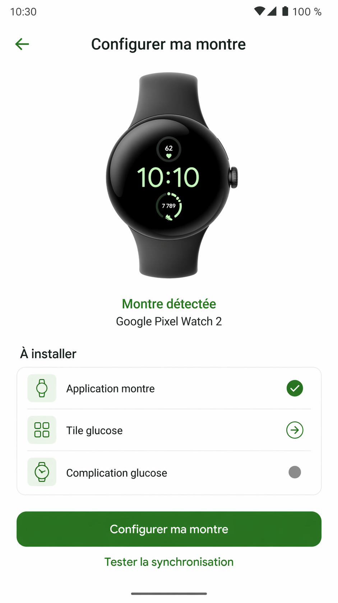

# Design System

Version de travail : 24 avril 2026

Ce document formalise la charte graphique cible de `GlucoWatch / Widget G7`.

Reference visuelle actuelle :

## 1. Direction visuelle

- Univers : sante connectee, calme, fiable, lisible
- Ton : clinique, simple, moderne, non anxiogene
- Priorite : lecture immediate de la donnee et des statuts
- Signature : base blanche nette, surfaces legerement vert froid, accent vert profond, montre dominante

Ce systeme doit privilegier :

- la clarte avant l'effet visuel
- des etats tres visibles
- des surfaces sobres, plates et peu ombrees
- peu d'elements parasites
- une composition centree autour de la montre sur l'accueil

## 2. Palette

### Fond

- `wg7_bg_top` : `#FFFFFF`
  - blanc net, utilise en haut des ecrans
- `wg7_bg_bottom` : `#F7FBFA`
  - voile vert froid tres leger, utilise en bas des ecrans

### Surfaces

- `wg7_surface` : `#FCFEFE`
  - surface principale, presque blanche
- `wg7_surface_alt` : `#F2F8F6`
  - surface secondaire avec leger voile vert froid
- `wg7_outline` : `#D8E5E1`
  - contour discret des blocs et bordures

### Texte

- `wg7_text_primary` : `#1F2A2A`
  - titre, chiffres, labels principaux
- `wg7_text_secondary` : `#6A7875`
  - aides, descriptions, statuts secondaires

### Accent principal

- `wg7_accent` : `#0F766E`
  - bouton principal, lien fort, action de reference
- `wg7_accent_dark` : `#0A5E58`
  - texte sur fond tonique clair, variantes appuyees
- `wg7_accent_soft` : `#D7EEE9`
  - fond tonique doux
- `wg7_on_accent` : `#FFFDF9`
  - texte sur bouton principal

### Etats

- `wg7_success` : `#2E7D32`
  - etat OK / connexion valide
- `wg7_success_soft` : `#DDF2DF`
  - fond succes doux
- `wg7_watch_green` : `#66FF57`
  - vert tres visible reserve a l'affichage montre
- `wg7_alert` : `#A65A2A`
  - attention / sync limitee
- `wg7_alert_soft` : `#F8E3D3`
  - fond attention doux
- `wg7_danger` : `#C62828`
  - erreur / echec / deconnexion
- `wg7_danger_soft` : `#F9DEDE`
  - fond danger doux

### Usage recommande

- fond d'ecran : base blanche `wg7_bg_top` avec leger bas `wg7_bg_bottom`
- cartes : surfaces pleines, sobres, contour `wg7_outline`, pas d'ombre visible
- texte principal : `wg7_text_primary`
- texte secondaire : `wg7_text_secondary`
- action principale : `wg7_accent`
- etat OK : `wg7_success` ou `wg7_watch_green` selon contexte
- attention : `wg7_alert`
- erreur : `wg7_danger`

## 3. Typographie

Police :

- sans-serif systeme Android / Material

Hierarchie :

- titre d'ecran : `30sp`, bold
- titre de section : `18sp`, bold
- label de card : `16sp` a `17sp`, bold
- texte principal : `15sp` a `16sp`
- texte secondaire : `13sp` a `15sp`
- chiffre critique / glycemie : beaucoup plus grand, selon la surface

Regles :

- le texte principal ne doit jamais etre gris
- le texte secondaire doit rester lisible, jamais trop pale
- les titres doivent toujours etre dans `wg7_text_primary`

## 4. Formes et espacements

### Cartes

Reference actuelle :

- style : `Widget.WidgetG7.SectionCard`
- rayon : `20dp` a `24dp`
- contour : `1dp`
- elevation : `0dp`

Regles :

- privilegier des blocs sobres et stables
- eviter les separations trop fines a l'interieur
- garder une densite plus clinique, sans effet premium decoratif

### Boutons

Reference actuelle :

- principal : `Widget.WidgetG7.PrimaryButton`
- secondaire : `Widget.WidgetG7.SecondaryButton`
- tonal : `Widget.WidgetG7.TonalButton`

Regles :

- hauteur mini : `56dp`
- rayon : `18dp`
- un seul bouton principal visible par zone fonctionnelle
- les boutons secondaires servent a ouvrir des reglages ou actions annexes

### Champs

Reference actuelle :

- `Widget.WidgetG7.InputLayout`
- surface blanche
- angle arrondi `20dp`

Regles :

- eviter les bordures trop fortes
- garder un contraste doux, mais net
- champs alignes et espacement vertical regulier

## 5. Composants

### Card de statut

Doit contenir :

- un titre court
- un statut simple
- un seul CTA fort si necessaire

Exemples :

- `DEXCOM`
- `MONTRE`
- `AUTORISATIONS`

### Statuts

Regles :

- `Connecte / Connectee` = vert
- `Reconnecter / Sync limitee` = orange
- `Non connecte / Erreur` = rouge
- ne pas afficher trop de texte dans le statut principal

### Messages d'aide

Regles :

- phrases courtes
- une seule action par phrase si possible
- style direct et simple

## 6. Mapping ecran par ecran

### Accueil

Objectif :

- faire de la montre l'element principal de l'ecran
- donner l'etat de connexion de la montre immediatement
- organiser les actions autour de la montre

Regles :

- utiliser la montre de la reference comme repere visuel pour l'accueil
- la montre doit etre grande, centree et nette
- `Connectee` et le modele de montre doivent rester centres sous la montre
- `Parametres / Sync` doivent rester groupes sous le hero
- le menu secondaire doit rester opaque, sans ombre parasite, centre sous les boutons
- `Dexcom` et `Autorisations` ne doivent pas redevenir des cartes principales sur l'accueil

### Connexion Dexcom

Objectif :

- rassurer
- montrer une seule action principale

Regles :

- titre fort
- texte d'aide court
- legal lisible mais discret
- CTA unique `Se connecter`

### Reglages Dexcom

Objectif :

- formulaire simple
- retour visuel de verification

Regles :

- fond calme
- champs bien espaces
- statut clair au-dessus des inputs

### Configuration montre

Objectif :

- guider l'installation et l'activation des composants montre
- verifier la liaison

Regles :

- wording principal : `Configurer ma montre`
- composants a presenter simplement : `Application montre`, `Tile glucose`, `Complication glucose`
- texte de test concret et court
- si plusieurs montres, afficher clairement la montre principale
- le bouton principal doit decrire une action reelle

### Notice

Objectif :

- lecture simple
- pas d'effet decoratif lourd

Regles :

- texte noir
- fond calme
- bouton retour discret

## 7. Regles de coherence

- ne pas multiplier les verts
- reserver le vert tres vif a la montre / glycemie
- garder l'orange uniquement pour les cas de limite ou attention
- ne pas mettre de rouge hors erreurs ou alertes claires
- garder les memes rayons de coins partout
- garder les memes hauteurs de bouton partout
- eviter les textes trop longs dans les cards d'accueil

## 8. Ce qu'il faut eviter

- copier l'identite Dexcom telle quelle
- surcharger les ecrans
- melanger trop de couleurs d'etat
- utiliser plusieurs styles de boutons pour une meme action
- transformer les ecrans de sante en UI "gadget"

## 9. Base technique actuelle

Les tokens deja en place sont principalement dans :

- [colors.xml](C:/Users/Utilisateur/Desktop/THP/Projects/Widget%20G7/mobile/src/main/res/values/colors.xml)
- [styles.xml](C:/Users/Utilisateur/Desktop/THP/Projects/Widget%20G7/mobile/src/main/res/values/styles.xml)

## 10. Reco de suite

Ordre conseille :

1. stabiliser tous les textes visibles utilisateur
2. harmoniser les ecrans sur cette palette
3. reduire la verbosite de certaines cards
4. ensuite seulement envisager une vraie passe design plus large
