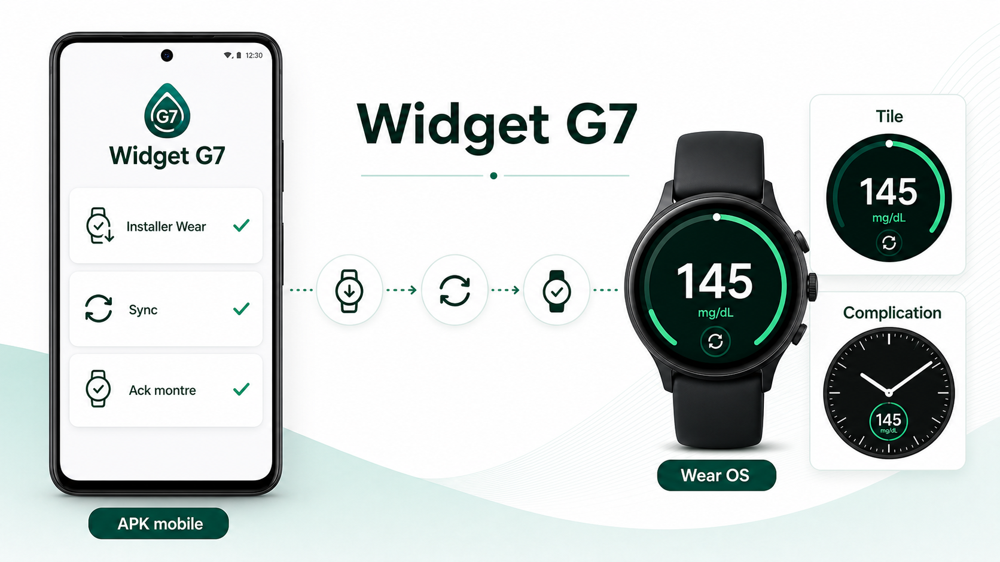

<h1 align="center">Présentation APK Widget G7</h1>

<p align="center">
  APK mobile · installation distante Wear · tile · complication
</p>

---

<p align="center">
  
</p>

---

## Message À Retenir

```text
Widget G7 part d'un APK mobile.
L'objectif produit est Wear OS natif.
Le mobile installe l'app Wear à distance quand c'est possible.
La montre affiche ensuite la valeur dans l'app, la tile et la complication.
```

---

## Usage

| Support | Usage |
| --- | --- |
| [presentation-apk-widget-g7.png](assets/presentation-apk-widget-g7.png) | Image de présentation |
| [MODE_D_EMPLOI.md](MODE_D_EMPLOI.md) | Parcours utilisateur |
| [PLAN_INSTALLATION_DISTANTE_WEAR.md](PLAN_INSTALLATION_DISTANTE_WEAR.md) | Plan technique |
