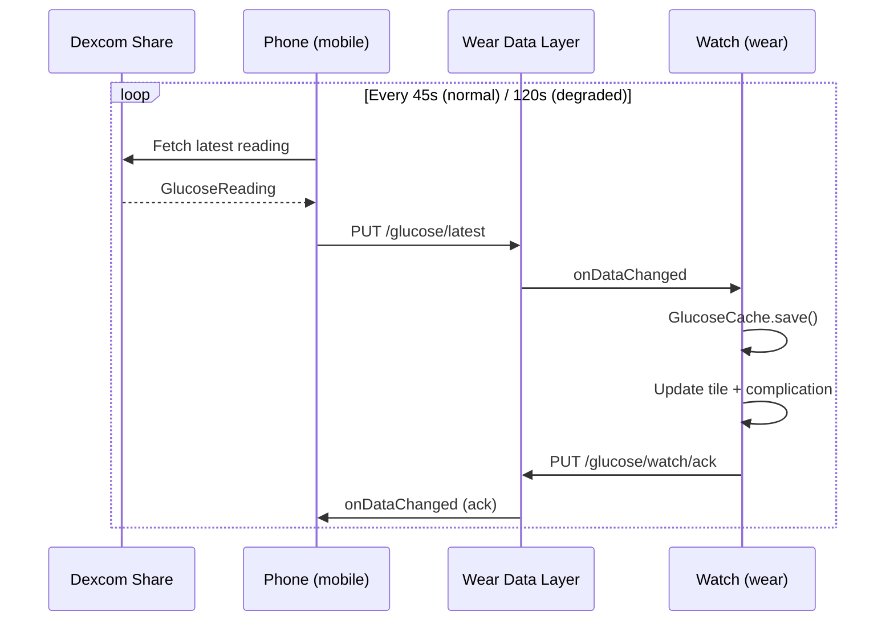

# Sync pipeline

> **Last updated:** 2026-05-23  
> **Related:** [Data Layer contract](data-layer-contract.md) · [Troubleshooting](../user/troubleshooting.md)

---

## End-to-end flow

1. Phone reads latest glucose from **Dexcom Share**
2. `GlucoseSyncEngine` decides whether to push (new reading or forced)
3. `WearSyncPublisher` writes `/glucose/latest` via Data Layer (`setUrgent()`)
4. Watch `WearDataLayerListenerService` receives data, saves `GlucoseCache`, refreshes surfaces
5. Watch sends ack on `/glucose/watch/ack`
6. Phone `PhoneWearRefreshRequestService` records ack in `PhoneSyncStateStore`



---

## Key classes

### Phone

| Class | Role |
|-------|------|
| `ActiveGlucoseSyncService` | Foreground service; polling loop |
| `PhoneGlucoseSyncEngine` | Adapts ports to phone stores/services |
| `GlucoseSyncEngine` | Core fetch + push logic |
| `PhoneWearSyncService` | Resolves watch node, calls publisher |
| `WearSyncPublisher` | `PutDataMapRequest` on `/glucose/latest` |
| `PhoneWearRefreshRequestService` | Handles refresh requests, acks, watch status |
| `PhoneSyncStateStore` | Push/ack sequence IDs |
| `WatchConnectionRepository` | Connected watch nodes |
| `PhoneAutoSyncScheduler` | Alarm fallback every 90s |

### Watch

| Class | Role |
|-------|------|
| `WearDataLayerListenerService` | Receives glucose + refresh status |
| `GlucoseCache` | SharedPreferences cache (stale after 2 min) |
| `GlucoseSimpleTileService` | Renders tile from cache |
| `GlucoseComplicationService` | Renders complication from cache |
| `GlucoseRefreshActivity` | Manual refresh proxy (message to phone) |
| `WatchSyncHealthMonitor` | Battery / low-power reporting |

---

## Poll intervals

| Mode | Interval | Trigger |
|------|----------|---------|
| Normal | 45 s | Default |
| Degraded | 120 s | Watch battery ≤20%, not charging, or `syncLimited` |
| Alarm fallback | 90 s | `PhoneAutoSyncScheduler` |

---

## Manual refresh paths

| Source | Mechanism |
|--------|-----------|
| Phone home — Sync button | `ActiveGlucoseSyncController.syncNow()` |
| Phone notification action | Same |
| Watch tile — sync button | `GlucoseRefreshActivity` → message `/glucose/refresh/request` |
| Watch (planned wiring) | Currently **not connected** in tile layout — Phase 0 fix |

---

## Offline / watch not worn

When the watch is off-wrist, powered off, or out of Bluetooth range:

| Behavior | Detail |
|----------|--------|
| Phone keeps fetching Dexcom | Independent of watch connectivity |
| Push returns `false` | `connectedNodes` empty — **silent in background sync** |
| Ack chain breaks | Phone UI: no "watch link confirmed" chevron |
| Watch shows cached value | Marked **stale** after 2 minutes (grey trend) |
| Data Layer may buffer | Urgent items can deliver on reconnect |
| Repush repair | Retries at 10/20/30 s — **stops on first failure** (Phase 2 fix) |

### Target behavior (Phase 2) ✅ code

- Persistent `PendingPushQueue` on phone (`PendingPushQueue.kt`)
- Flush on reconnect via `PendingPushFlusher` + `WatchReconnectDetector` + `onPeerConnected`
- WorkManager fallback in `PhoneGlucoseSyncWorker`
- Phone shows "Watch disconnected" badge (Phase 0)

---

## Unacked delivery repair

After each sync pass, if `lastAckSequenceId != lastPushSequenceId`:

- Repush at 10 / 20 / 30 s (normal) or 20 / 45 s (degraded)
- Aborts if repush returns `false` (watch unreachable)

---

## Verification checklist

- [ ] Build succeeds
- [ ] Watch ack received (`lastAckSequenceId == lastPushSequenceId`)
- [ ] Phone and watch values match
- [ ] `stale = false` when data is fresh (< 2 min)
- [ ] 30 min continuous sync without drift

## Debug commands

```powershell
.\gradlew.bat :mobile:assembleDebug :wear:assembleDebug
.\gradlew.bat installWidgetG7Debug
```

---

## Related

- [Data Layer contract](data-layer-contract.md)
- [Master refactor plan](../plan/MASTER-REFACTOR-PLAN.md) — Phase 0–2 sync fixes
