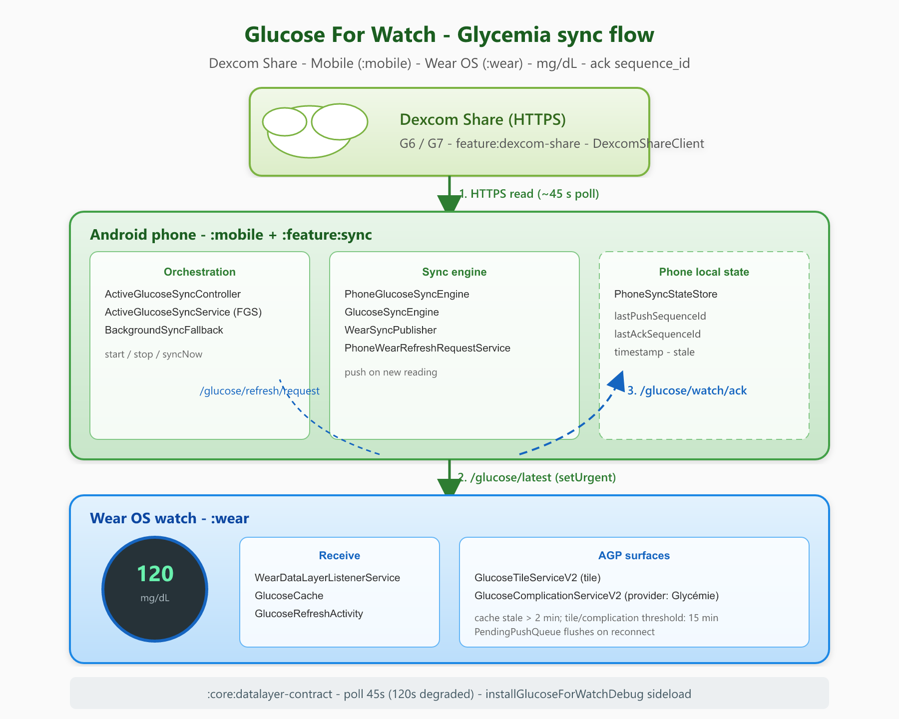

# Architecture

Glucose For Watch syncs Dexcom Share glucose from a phone to a Wear OS companion via the Wear Data Layer.



> Source (editable): [glucose-for-watch-architecture.svg](../assets/glucose-for-watch-architecture.svg) — regenerate PNG: `.\scripts\assets\export-architecture-diagram.ps1`

## Modules

| Module | Role |
|--------|------|
| `:mobile` | Phone UI, Dexcom fetch, sync orchestration |
| `:wear` | Cache, tile, complication, Data Layer listener, ack |
| `:core:model` | `GlucoseReading`, `SyncStatus` |
| `:core:datalayer-contract` | Wear Data Layer paths and keys |
| `:feature:sync` | `GlucoseSyncEngine`, publishers, policies |
| `:feature:dexcom-share` | Dexcom Share HTTP client |
| `:feature:watch-install` | Embedded wear APK install (debug) |

The modules have distinct source namespaces (`com.glucoseforwatch.mobile` and
`com.glucoseforwatch.wear`), but both APKs currently use the application ID
`com.glucoseforwatch.mobile`. Install the phone APK on the phone and the Wear
APK on the watch; they are not two installable packages for the same device.

## Sync flow

1. Phone reads latest glucose from **Dexcom Share**
2. `GlucoseSyncEngine` decides whether to push
3. `WearSyncPublisher` writes `/glucose/latest` via Data Layer (`setUrgent()`)
4. Watch `WearDataLayerListenerService` saves `GlucoseCache`, refreshes tile/complication
5. Watch sends ack on `/glucose/watch/ack`
6. Phone records ack in `PhoneSyncStateStore`

### Key classes

**Phone:** `ActiveGlucoseSyncController`, `ActiveGlucoseSyncService`, `BackgroundSyncFallback`, `PhoneGlucoseSyncEngine`, `GlucoseSyncEngine`, `WearSyncPublisher`, `PhoneWearRefreshRequestService`, `PhoneSyncStateStore`

**Watch:** `WearDataLayerListenerService`, `GlucoseCache`, `GlucoseTileServiceV2`, `GlucoseComplicationServiceV2`, `GlucoseRefreshActivity`

### Scheduler ownership (B.3)

All periodic sync scheduling goes through **`ActiveGlucoseSyncController`** — the single entry point for starting/stopping sync on the phone.

| Trigger | Handler |
|---------|---------|
| Boot / app open / Dexcom connect | `ActiveGlucoseSyncController.start()` |
| Dexcom disconnect / user stop | `ActiveGlucoseSyncController.stop()` |
| Manual sync (home button, watch tile) | `ActiveGlucoseSyncController.syncNow()` |
| Foreground service tick | `ActiveGlucoseSyncService` → engine poll |
| FGS refused (background quota) | `BackgroundSyncFallback` (WorkManager + alarm) |

`PhoneAutoSyncScheduler` is **not** called directly from activities or receivers anymore — duplicate FGS starts were removed in Bloc X.

### Poll intervals

| Mode | Interval |
|------|----------|
| Successful sync | 45 s (normal) or 120 s (low battery / `syncLimited`) |
| Consecutive sync failures | Exponential backoff from 15 s, capped at 5 min |
| Alarm fallback | 90 s |

### Manual refresh

| Source | Mechanism |
|--------|-----------|
| Phone Sync button | `ActiveGlucoseSyncController.syncNow()` |
| Watch tile Sync | `GlucoseRefreshActivity` → message `/glucose/refresh/request` |

### Offline behavior

- Phone keeps fetching Dexcom regardless of watch connectivity
- Push fails silently when no connected nodes
- Dexcom readings and the Wear cache are flagged stale after 2 min
- Tile visual staleness is based on reading age > 15 min; the complication uses
  a placeholder when the reading is older than 15 min
- `PendingPushQueue` flushes on reconnect; WorkManager catch-up as fallback
- Unacked delivery: repush at 10/30/60/120 s (normal) or 20/45/90 s
  (degraded)
- Interrupted-sync notification appears after 3 consecutive failures;
  Dexcom-auth notification appears after 2 consecutive authentication failures

### Dexcom Share authentication

The phone stores the user's Dexcom Share login details and region in encrypted
preferences. `US` uses `share2.dexcom.com`; `OUS` uses
`shareous1.dexcom.com`. A cached session is renewed once automatically when
Dexcom reports it expired. Reading timestamps older than 2 minutes are flagged
stale; that source/cache flag is distinct from the 15-minute Wear surface
display thresholds above.

## Data Layer contract

Source: `core/datalayer-contract/.../GlucoseDataLayerContract.kt`

### Paths

| Path | Direction | Purpose |
|------|-----------|---------|
| `/glucose/latest` | Phone → Watch | Latest glucose payload |
| `/glucose/refresh/request` | Watch → Phone | Manual refresh trigger |
| `/glucose/refresh/status` | Phone → Watch | Refresh progress |
| `/glucose/watch/ack` | Watch → Phone | Delivery confirmation |
| `/watch/status` | Watch → Phone | Battery, low-power, sync-limited |

### `/glucose/latest` keys

| Key | Type | Description |
|-----|------|-------------|
| `value_mg_dl` | int | Glucose value |
| `trend` | string | Normalized trend token |
| `delta` | int | Delta from previous |
| `timestamp_epoch_ms` | long | Reading timestamp |
| `sequence_id` | long | Monotonic push sequence |
| `stale` | boolean | Dexcom/Wear cache reports the reading stale (over 2 min old) |
| `displayUnit` | string | `MG_DL` or `MMOL_L` — display unit for tile/complication text (internal value stays mg/dL) |

### Ack keys

`sequence_id`, `received_at_epoch_ms` — phone compares `lastPushSequenceId` vs `lastAckSequenceId`.

## UI layers

| Layer | Standard | Scope |
|-------|----------|-------|
| Medical (glucose values) | AGP / TIR colors | Tile, complication, phone hero |
| Chrome | ToXY kit (Material 3 dark) | Backgrounds, buttons, navigation |

Spec: [toxy-ux-kit/spec/01-agp-medical-layer.md](../../toxy-ux-kit/spec/01-agp-medical-layer.md)

## Design decisions

1. Dexcom Share HTTP (follower flow), not OAuth v3
2. Ack-based delivery verification
3. Foreground sync service for reliable polling
4. Embedded wear APK in debug mobile build
5. Protolayout tiles (Material Tiles 1.5 target)

## Verification

```powershell
.\gradlew.bat :mobile:assembleDebug :wear:assembleDebug
.\gradlew.bat installGlucoseForWatchDebug
```

- Phone and watch values match
- `lastAckSequenceId == lastPushSequenceId`
- Dexcom/Wear cache stale flag clears for fresh data (< 2 min)
- Tile and complication apply their separate 15-minute display thresholds
