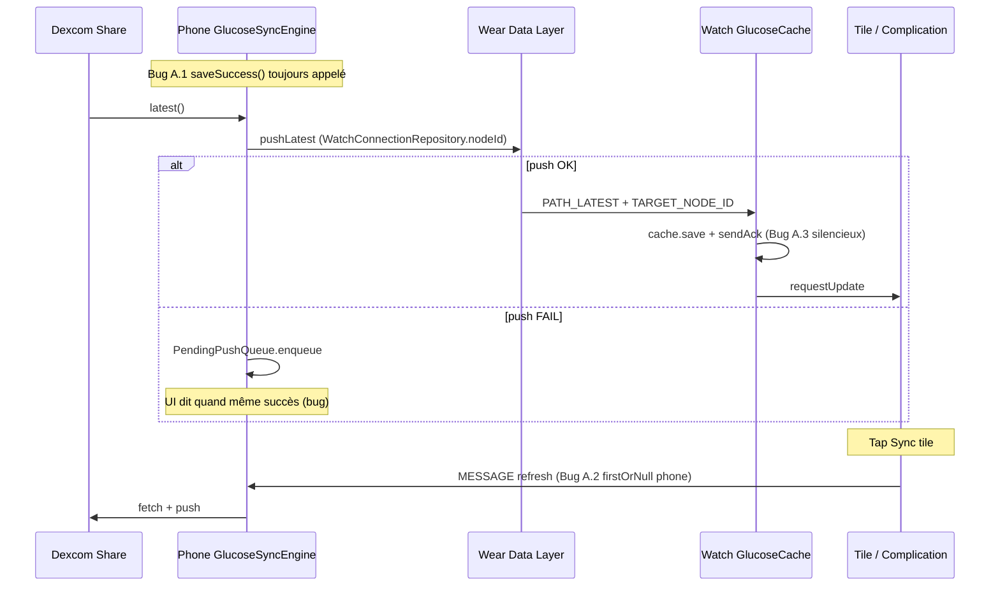

# Plan d’action post-audit — Glucose For Watch (détaillé)

> **Version :** 2.0 · 2026-05-23  
> **Public :** développeur solo / petit équipe  
> **Suivi :** cocher `[ ]` → `[x]` ici · résumer dans [PROGRESS.md](PROGRESS.md)  
> **Contexte audit :** architecture OK · écarts = sync vérité métier, produit, QA hardware, release Play Store

---

## Table des matières

1. [Carte des flux sync (référence)](#1-carte-des-flux-sync-référence)
2. [Vue d’ensemble & jalons](#2-vue-densemble--jalons)
3. [Sprint 1 — Sync P0 (PR #1–#3)](#3-sprint-1--sync-p0)
4. [Sprint 2 — Tests & QA (PR #4–#5)](#4-sprint-2--tests--qa)
5. [Sprint 3 — Produit & UI (PR #6–#7)](#5-sprint-3--produit--ui)
6. [Sprint 4 — Legal & release (PR #8+)](#6-sprint-4--legal--release)
7. [Annexes](#7-annexes)

---

## 1. Carte des flux sync (référence)

Comprendre **où** agir avant de coder.



| Composant | Fichier | Rôle |
|-----------|---------|------|
| Moteur sync | `feature/sync/.../GlucoseSyncEngine.kt` | fetch → push → queue |
| Orchestration phone | `mobile/.../PhoneGlucoseSyncEngine.kt` | ports + **saveSuccess bug** |
| Cible montre push | `mobile/.../PhoneWearSyncService.kt` | via `WatchConnectionRepository` |
| Montre préférée | `mobile/.../WatchConnectionRepository.kt` | `preferredNodeId` ou `firstOrNull()` |
| Refresh tile | `wear/.../GlucoseRefreshActivity.kt` | **`nodes.firstOrNull()` phone** |
| Réception montre | `wear/.../WearDataLayerListenerService.kt` | filtre `TARGET_NODE_ID` |
| ACK montre → phone | idem `sendAck()` | échec silencieux |
| Repush backoff | `mobile/.../ActiveGlucoseSyncService.kt` | `repairUnackedDelivery()` |
| UI hero phone | `mobile/.../MainActivity.kt` | `consecutiveWearPushFailures` vs `syncStatus` |

---

## 2. Vue d’ensemble & jalons

### 2.1 Priorités

| P | Signification | Délai indicatif |
|---|---------------|-----------------|
| **P0** | Donnée ou sync mensongère | Sprint 1 (sem. 1–2) |
| **P1** | QA / produit / tests | Sprint 2–3 (sem. 3–5) |
| **P2** | Legal / Play Store | Sprint 4 (sem. 6–8) |

### 2.2 Jalons

| ID | Semaine | Livrable | Gate |
|----|---------|----------|------|
| **M4** | S2 | Sync P0 mergé + tests verts | `./gradlew test` |
| **M5** | S4 | Matrice QA signée | [QA-MATRIX-G6-G7.md](QA-MATRIX-G6-G7.md) 7/7 |
| **M6** | S5 | Rebrand doc + logo validé | grep ToXY user-facing = 0 |
| **M7** | S8 | v0.5.0 Play Console test interne | AAB signés |

### 2.3 Découpage PR recommandé

| PR | Contenu | Dépend de |
|----|---------|-----------|
| **#1** | A.4 `SyncExecutionResult` enrichi + `GlucoseSyncEngine` | — |
| **#2** | A.1 statut phone + `MainActivity` pill | #1 |
| **#3** | A.2 cible phone refresh + A.3 ACK | #1 |
| **#4** | Tests E.* + fix `DexcomSettingsActivity` | #2 |
| **#5** | QA scripts / matrice remplie | hardware |
| **#6** | Rebrand docs (liste fichier par fichier) | — |
| **#7** | Logo + design-reference | validation user |
| **#8** | Signing + wear release + dry-run | legal draft |

---

## 3. Sprint 1 — Sync P0

**Objectif :** le téléphone ne ment plus sur l’état montre.

---

### Tâche A.4.1 — Modèle `WatchDeliveryStatus`

**Fichier :** `feature/sync/src/main/java/com/widgetg7/feature/sync/SyncExecutionResult.kt`

**Étapes :**

- [ ] **A.4.1a** Ajouter enum ou sealed `WatchDeliveryStatus` :
  ```kotlin
  enum class WatchDeliveryStatus {
      NOT_APPLICABLE,      // pas de push tenté (pas de nouvelle lecture, pas force)
      DELIVERED,           // pushLatest == true
      QUEUED,              // push false, reading en PendingPushQueue
      WATCH_UNAVAILABLE,   // push false, pas de queue (edge)
  }
  ```
- [ ] **A.4.1b** Remplacer les data classes success :
  ```kotlin
  data class SuccessNewReading(
      val sourceName: String,
      val watchDelivery: WatchDeliveryStatus,
  ) : SyncExecutionResult

  data class SuccessNoNewReading(
      val sourceName: String,
      val watchDelivery: WatchDeliveryStatus,
  ) : SyncExecutionResult
  ```
- [ ] **A.4.1c** Garder `Failure(message)` inchangé.

**Tests (même PR) :** `GlucoseSyncEngineTest.kt`

| Test | Given | Then `watchDelivery` |
|------|-------|----------------------|
| A.4.T1 | new reading, push OK | `DELIVERED` |
| A.4.T2 | new reading, push fail + pending port | `QUEUED` |
| A.4.T3 | no new reading, triggeredFromWatch | `NOT_APPLICABLE` |
| A.4.T4 | pending retry, push OK | `DELIVERED` |
| A.4.T5 | new reading, push fail, triggeredFromWatch | `QUEUED` + refresh watch unavailable appelé |

**Fichier moteur :** `GlucoseSyncEngine.kt` lignes 47–71 — remplir `watchDelivery` dans chaque branche.

**DoD A.4.1 :** compile · 5 tests verts · aucun appelant cassé (fixer exhaustivité Kotlin).

---

### Tâche A.4.2 — Propagation aux appelants

**Fichiers à mettre à jour (grep `SyncExecutionResult`) :**

| Fichier | Action |
|---------|--------|
| `PhoneGlucoseSyncEngine.kt` | Utiliser `watchDelivery` pour statut (→ A.1) |
| `PhoneGlucoseSyncWorker.kt` | `Result.retry()` si `QUEUED` répété ? (documenter) |
| `DexcomSettingsActivity.kt` | Message test connexion : distinguer fetch vs montre |
| `GlucoseSyncEngineTest.kt` | Tests A.4.T* |
| `OfflineOnlineSyncScenarioTest.kt` | Adapter assertions |

- [ ] **A.4.2a** `when (result)` exhaustif partout (pas de branche default silencieuse).

---

### Tâche A.1.1 — `SyncStatusRepository` : succès partiel

**Fichier :** `feature/sync/.../SyncStatusRepository.kt`

**Problème actuel :** `saveSuccess()` remet `consecutiveFailureCount = 0` et efface toute erreur — même si montre KO.

**Étapes :**

- [ ] **A.1.1a** Ajouter méthode :
  ```kotlin
  fun saveFetchedReading(sourceName: String, reading: GlucoseReading) {
      // Met à jour valeur hero (Dexcom OK)
      // NE remet PAS consecutiveFailureCount à 0 si watch fail
      // NE efface PAS lastError watch-specific
  }
  ```
- [ ] **A.1.1b** Ajouter :
  ```kotlin
  fun saveWatchDeliveryPending(sourceName: String, reading: GlucoseReading) {
      // Comme saveFetchedReading +
      // lastError = "" ou message doux "En attente envoi montre"
      // consecutiveFailureCount inchangé ou +1 selon politique
  }
  ```
- [ ] **A.1.1c** `saveSuccess()` = fetch OK **+** `watchDelivery == DELIVERED` (alias complet).

**Clés prefs existantes :** `widget_g7_sync_status` — pas de migration DB nécessaire.

**DoD A.1.1 :** 3 méthodes testées unitairement (Robolectric ou prefs in-memory).

---

### Tâche A.1.2 — Fix `PhoneGlucoseSyncEngine.run()`

**Fichier :** `mobile/.../PhoneGlucoseSyncEngine.kt` lignes 96–99

**Étapes :**

- [ ] **A.1.2a** Supprimer le bloc inconditionnel :
  ```kotlin
  latestReading?.let { syncStatusRepository.saveSuccess(...) }
  ```
- [ ] **A.1.2b** Remplacer par :
  ```kotlin
  when (val r = result) {
      is SyncExecutionResult.Failure -> { /* déjà handleFailure */ }
      is SyncExecutionResult.SuccessNewReading,
      is SyncExecutionResult.SuccessNoNewReading -> {
          val reading = latestReading ?: return@when
          when (r.watchDelivery) {
              WatchDeliveryStatus.DELIVERED ->
                  syncStatusRepository.saveSuccess(r.sourceName, reading)
              WatchDeliveryStatus.QUEUED,
              WatchDeliveryStatus.WATCH_UNAVAILABLE ->
                  syncStatusRepository.saveWatchDeliveryPending(r.sourceName, reading)
              WatchDeliveryStatus.NOT_APPLICABLE ->
                  syncStatusRepository.saveFetchedReading(r.sourceName, reading)
          }
      }
  }
  ```
- [ ] **A.1.2c** Vérifier cohérence avec `PhoneSyncStateStore.recordWearPushUndelivered()` (déjà appelé dans `wearSync` port).

**Test :** `mobile/src/test/.../PhoneGlucoseSyncEngineTest.kt` (nouveau)

| ID | Mock | Assert |
|----|------|--------|
| A.1.T1 | `WearSyncPort` → false | `saveSuccess` **non** appelé |
| A.1.T2 | push OK | `saveSuccess` appelé |
| A.1.T3 | push fail | hero value mis à jour **mais** pill ≠ « sync active » |

---

### Tâche A.1.3 — UI `MainActivity` : pill sync

**Fichier :** `mobile/.../MainActivity.kt` (~lignes 210–225)

**État actuel :** utilise `PhoneSyncStateStore.consecutiveWearPushFailures` **et** `syncStatus.lastError` — peut diverger après fix.

**Étapes :**

- [ ] **A.1.3a** Ordre de priorité pill (documenter dans KDoc) :
  1. Dexcom non configuré → « Connecter Dexcom »
  2. `syncStatus.lastError` AUTH → message auth
  3. `consecutiveWearPushFailures >= 3` → `home_status_watch_unreachable`
  4. `watchDelivery` pending (nouveau flag prefs ou dérivé queue) → « Envoi montre en attente »
  5. Sync active → vert
- [ ] **A.1.3b** Ajouter string `mobile/.../strings.xml` :
  - `home_status_watch_push_pending`
- [ ] **A.1.3c** `updateSyncButtonTint` : orange/bleu si pending watch ?

**DoD A.1.3 :** capture PNG Robolectric ou screenshot : push fail simulé → pill warning, chiffre glycémie à jour.

---

### Tâche A.2.1 — Résolution nœud phone côté montre

**Problème :** `GlucoseRefreshActivity` envoie le refresh au premier phone connecté, pas au phone « pair » du push.

**Option retenue (v1) :** phone unique — si plusieurs phones, prendre le nœud qui a **dernier poussé** (`PATH_LATEST` source) ou le seul nœud `isNearby`.

**Étapes :**

- [ ] **A.2.1a** Créer `wear/.../sync/PhoneTargetResolver.kt` :
  ```kotlin
  object PhoneTargetResolver {
      fun selectPhoneNodeId(
          connectedNodes: List<Node>,
          lastPushSourceNodeId: String?, // lu depuis GlucoseCache prefs
      ): String?
  }
  ```
- [ ] **A.2.1b** Dans `GlucoseCache` : persister `lastPhoneNodeId` à la réception `PATH_LATEST` (DataMap peut inclure `sourceNodeId` — vérifier `WearSyncPublisher.kt`).
- [ ] **A.2.1c** Si `WearSyncPublisher` n’envoie pas source phone : ajouter clé `GlucoseKeys.SOURCE_PHONE_NODE_ID` dans `core/datalayer-contract`.
- [ ] **A.2.1d** Refactor `GlucoseRefreshActivity` :
  ```kotlin
  val nodeId = PhoneTargetResolver.selectPhoneNodeId(nodes, cache.lastPhoneNodeId())
  ```
- [ ] **A.2.1e** Cas 0 phone : message existant « Téléphone indisponible ».
- [ ] **A.2.1f** Cas 2+ phones sans historique : **premier trié par displayName** + log warning (documenter limitation).

**Fichiers touchés :**

- `core/datalayer-contract/.../GlucoseDataLayerContract.kt` (nouvelle clé)
- `feature/sync/.../WearSyncPublisher.kt` (écrire clé)
- `wear/.../WearDataLayerListenerService.kt` (lire clé)
- `wear/.../GlucoseRefreshActivity.kt`

**Test :** `wear/src/test/.../PhoneTargetResolverTest.kt`

| Cas | Nodes | lastPush | Expected |
|-----|-------|----------|----------|
| A.2.T1 | [A,B] | A | A |
| A.2.T2 | [A,B] | null | A (stable sort) |
| A.2.T3 | [] | * | null |

**DoD A.2.1 :** tile sync avec 1 phone USB → refresh < 30 s (QA B.1.5).

---

### Tâche A.3.1 — ACK montre fiable

**Fichier :** `wear/.../WearDataLayerListenerService.kt` `sendAck()` lignes 93–105

**Étapes :**

- [ ] **A.3.1a** Remplacer `runCatching` silencieux par :
  ```kotlin
  private fun sendAck(...) {
      serviceScope.launch {
          repeat(MAX_ACK_ATTEMPTS) { attempt ->
              val result = runCatching { putDataItem(...) }
              if (result.isSuccess) return@launch
              Log.w(TAG, "ack_failed attempt=${attempt + 1}", result.exceptionOrNull())
              delay(ACK_RETRY_MS * (attempt + 1))
          }
          cache.recordAckFailed(sequenceId) // nouvelle méthode légère
          healthMonitor.recordAckFailure()
      }
  }
  ```
- [ ] **A.3.1b** Constantes : `MAX_ACK_ATTEMPTS = 3`, `ACK_RETRY_MS = 500L`
- [ ] **A.3.1c** `WatchSyncHealthMonitor` : compteur ack fail exposé au phone via PATH existant ou health payload.

**Interaction A.1 :** `repairUnackedDelivery()` dans `ActiveGlucoseSyncService` doit rester le filet — ajouter test d’intégration mock.

**Test :** `wear/src/test/.../WearAckRetryTest.kt` (mock DataClient si lourd → test logique retry pure)

**DoD A.3.1 :** logcat filtrable `WG7.WearDataLayer` · ack fail visible.

---

### Gate Sprint 1

```powershell
.\gradlew.bat :feature:sync:test :mobile:testDebugUnitTest :wear:testDebugUnitTest
.\gradlew.bat :mobile:assembleDebug :wear:assembleDebug
```

| Check | Commande / action |
|-------|-------------------|
| Tests sync | ≥ 10 tests feature:sync verts |
| Nouveaux tests | A.1.T*, A.2.T*, A.4.T* |
| Lint | pas de régression AGP mint sur glycémie |
| Smoke manuel | airplane watch → push fail → pill phone cohérente |

---

## 4. Sprint 2 — Tests & QA

---

### Tâche B.1 — QA hardware (procédure pas à pas)

**Prérequis matériel :**

- [ ] Phone Android 12+ USB debug (`adb devices`)
- [ ] Montre Wear OS 3+ USB/WiFi debug
- [ ] Compte Dexcom Share actif (G7 prioritaire ; G6 si dispo)
- [ ] Câble / WiFi adb stable

**Install (15 min) — Tâche B.1.1**

```powershell
cd "...\Widget G7"
.\scripts\qa\quick-run.ps1
# ou
.\gradlew.bat installWidgetG7Debug
adb devices -l
```

| Step | Action | OK si |
|------|--------|-------|
| B.1.1.1 | Phone installé, app « Glucose For Watch » visible | launcher OK |
| B.1.1.2 | Watch installée, même package `com.widgetg7.mobile` | settings > apps |
| B.1.1.3 | Tile « Glycémie » ajoutée au carrousel | tile visible |
| B.1.1.4 | Complication SHORT_TEXT sur cadran | slot rempli |

**Dexcom Share — Tâche B.1.2**

| Step | Action | OK si |
|------|--------|-------|
| B.1.2.1 | Phone > Dexcom > login Share US ou OUS | « Compte actif » |
| B.1.2.2 | Attendre 1 cycle sync (≤ 5 min) | hero phone valeur + couleur AGP |
| B.1.2.3 | Vérifier tile = phone valeur | match ± 1 min |

**Sync 30 min — Tâche B.1.3**

| Min | Observation | Noter |
|-----|-------------|-------|
| 0 | Valeur initiale V0 | |
| 5 | V1, delta temps | |
| 15 | Pas de crash, pas de `--` | |
| 30 | ≥ 4 updates, pas dérive > 10 min | |

**Offline 2 h — Tâche B.1.4** (critique M2/M5)

| Step | Action | OK si |
|------|--------|-------|
| B.1.4.1 | Montre mode avion ON | tile stale / dernier val |
| B.1.4.2 | Phone continue (écran veille OK) | fetch Dexcom continue |
| B.1.4.3 | Attendre 1–2 h | phone badge montre hors portée (≥ 3 fail) |
| B.1.4.4 | Montre avion OFF | auto catch-up ≤ 5 min sans réinstall |
| B.1.4.5 | Vérifier `PendingPushQueue` drain | tile = phone |

**Tile — Tâches B.1.5–B.1.6**

| Step | Action | OK si |
|------|--------|-------|
| B.1.5.1 | Tap ↻ Sync sur tile | phone log sync + nouvelle val < 30 s |
| B.1.6.1 | Vérifier bords ronds | pas de clip chiffre/bouton |
| B.1.6.2 | Petite montre (< 225 dp) | layout v8 `simple-tile-v8-round-safe` |

**Couleurs AGP — Tâche B.1.8**

| mg/dL cible | Où vérifier | Token |
|-------------|-------------|-------|
| ~120 | phone hero, tile chiffre | vert in-range |
| ~200 | idem | jaune high |
| ~60 | idem | rouge low |
| LOW/HI | libellé texte | very_low / very_high |

**Livrable B.1 :** remplir [QA-MATRIX-G6-G7.md](QA-MATRIX-G6-G7.md) · screenshots dans `docs/qa/captures/` (créer dossier) · Issues GitHub pour échecs.

---

### Tâche B.2 — Automatisation CI

| ID | Tâche | Fichier | Statut |
|----|-------|---------|--------|
| B.2.1 | Export PNG home post-PR UI | `.github/workflows/ci.yml` job optionnel | ☐ |
| B.2.2 | Test tile metrics | `ToxyTileThemeTest.kt` | ✅ |
| B.2.3 | Test `PhoneGlucoseSyncEngine` delivery | nouveau | ☐ |
| B.2.4 | Spike `tiles-testing` render 200dp + 240dp | `wear/src/test/` | ☐ |

**B.2.1 détail :** step après `./gradlew test` :
```yaml
- run: ./gradlew :mobile:testDebugUnitTest --tests "*.AppPreviewExporterTest"
- uses: actions/upload-artifact@v4
  with:
    name: app-preview
    path: mobile/build/app-previews/mobile-home.png
```

---

### Tâche E — Catalogue tests à ajouter

| ID | Module | Fichier test | Scénario |
|----|--------|--------------|----------|
| E.1 | mobile | `PhoneGlucoseSyncEngineTest.kt` | push fail → pas saveSuccess |
| E.2 | feature:sync | `GlucoseSyncEngineTest.kt` | watchDelivery branches |
| E.3 | wear | `PhoneTargetResolverTest.kt` | multi-node |
| E.4 | wear | `WearAckPolicyTest.kt` | retry count |
| E.5 | mobile | `MainActivitySyncPillTest.kt` | Robolectric pill texte |
| E.6 | feature:sync | `OfflineOnlineSyncScenarioTest.kt` | queued → delivered |

**Gate :** `./gradlew.bat test` · 0 failed · couverture sync modules ≥ baseline + 6 tests.

---

## 5. Sprint 3 — Produit & UI

---

### Tâche C.1 — Rebrand « Glucose For Watch » (liste exhaustive)

**Règle :** user-facing → « Glucose For Watch » · interne code → garder `toxy_*`, `ToxyTileTheme`, package `com.widgetg7`.

#### C.1.A — Docs utilisateur (obligatoire)

| Fichier | Remplacements | Statut |
|---------|---------------|--------|
| `README.md` | titre, install steps, « Open app » | ✅ |
| `docs/index.md` | titre app | ✅ |
| `docs/user/manual.md` | toutes mentions ToXY | ✅ |
| `docs/user/quick-start.md` | idem | ✅ |
| `docs/user/troubleshooting.md` | idem | ✅ |
| `docs/release-notes.md` | garder ToXY en historique v0.4.0 seulement | ✅ |
| `docs/plan/QA-MATRIX-G6-G7.md` | titre + prérequis | ✅ |
| `docs/plan/MASTER-REFACTOR-PLAN.md` | objectif app | ✅ |
| `docs/plan/PROGRESS.md` | en-tête | ✅ |
| `CHANGELOG.md` | entrée v0.5.0 rebrand | ✅ |
| `CONTRIBUTING.md` | nom app dans QA refs | ✅ |

#### C.1.B — Docs dev (secondaire)

| Fichier | Action |
|---------|--------|
| `docs/architecture/overview.md` | mention produit |
| `docs/development/developer-handoff.md` | idem |
| `docs/legal/publication-checklist.md` | nom store |
| `.github/pull_request_template.md` | nom app |
| `.github/ISSUE_TEMPLATE/feature_request.md` | idem |

#### C.1.C — **Ne pas renommer** (kit interne)

- `toxy-ux-kit/**` — reste nom kit design
- `mobile/.../toxy_colors.xml`, `ToxyTileTheme.kt`, `ToxyWearColorScheme.kt`
- Skills Cursor `widget-g7-toxy-theme-maintainer`

**Vérification :**
```powershell
rg -l "ToXY" --glob "!toxy-ux-kit/**" --glob "!docs/release-notes.md" --glob "!.cursor/**"
# → 0 résultat user-facing
```

**DoD C.1 :** grep clean · QA matrix à jour · app_name déjà OK dans `strings.xml`.

---

### Tâche C.2 — Identité visuelle

| ID | Action | Fichiers | Owner |
|----|--------|----------|-------|
| C.2.1 | Valider logo montre carré | `ic_brand_mark.xml`, `ic_launcher_foreground.xml`, `ic_wear_launcher.xml` | User |
| C.2.2 | Export previews | `scripts/qa/export-app-preview.ps1` | Dev |
| C.2.3 | Contraste hero WCAG AA | `MainActivity.applyHeroReadingColor` + tokens AGP | Dev |
| C.2.4 | Mettre à jour maquette | `toxy-ux-kit/design-reference/index.html` | Dev |
| C.2.5 | Fix commentaires obsolètes | `WearStatusScreen.kt` (« mint ») | Dev |

**C.2.3 procédure :** ratio contraste ≥ 4.5:1 pour `agp_inRange` sur `wg7_surface` — outil WebAIM ou script.

---

### Tâche C.3 — Tile Material 3 (option v0.5.1)

**Décision point :** seulement si B.1.6 échoue sur hardware.

| Step | Action |
|------|--------|
| C.3.1 | Monter `androidx.wear.protolayout:protolayout-material3` aligné tiles 1.5+ |
| C.3.2 | Spike 4h : `materialScope` + `primaryLayout` + `textEdgeButton` |
| C.3.3 | Compare screenshot Pixel Watch 41mm vs impl v8 |
| C.3.4 | Go/No-Go documenté dans PROGRESS |

---

## 6. Sprint 4 — Legal & release

---

### Tâche D — Sécurité & conformité (détail)

| ID | Action | Fichier / outil | Critère |
|----|--------|-----------------|---------|
| D.1 | Doc keystore Android | `docs/legal/keystore.md` (créer) | rotation documentée |
| D.2 | Audit logs | `rg "password\|token\|session" mobile wear feature` | 0 log clair |
| D.3 | Privacy policy FR | `docs/legal/privacy-policy.md` | email contact, données Dexcom, Wear |
| D.4 | Data Safety brouillon | `docs/legal/play-data-safety.md` | health, encrypted transit |
| D.5 | Manifest backup | `mobile/wear AndroidManifest.xml` | `allowBackup=false` |
| D.6 | Credentials | `AppSettingsStore.kt` | déjà EncryptedSharedPreferences ✅ |

**Gate D :**
```powershell
bash scripts/release/check_legal_placeholders.sh
# sans ALLOW_INCOMPLETE_LEGAL=1
```

---

### Tâche F — Release Play Store v0.5.0 (playbook)

#### F.1 Signing (local, hors git)

| Step | Action |
|------|--------|
| F.1.1 | Créer keystore `glucose-for-watch-release.jks` (backup 2 lieux) |
| F.1.2 | `mobile/keystore.properties` (gitignore) :
  ```properties
  storeFile=../keystore/glucose-for-watch-release.jks
  storePassword=***
  keyAlias=upload
  keyPassword=***
  ```
| F.1.3 | `mobile/build.gradle.kts` :
  ```kotlin
  signingConfigs { create("release") { ... } }
  buildTypes.release.signingConfig = signingConfigs.getByName("release")
  ```
| F.1.4 | Idem wear module |

#### F.2 Wear release (plus debug embarqué)

| Step | Action |
|------|--------|
| F.2.1 | `:wear:assembleRelease` produit APK/AAB signé |
| F.2.2 | Phone **debug** : garder `prepareWearApkForDebugAssets` (install assistée) |
| F.2.3 | Phone **release** : **ne pas** embarquer wear debug — listing Play Wear séparé |
| F.2.4 | Doc utilisateur : install montre via Play Store Wear |

#### F.3 Versioning

| Module | Actuel | v0.5.0 proposé |
|--------|--------|----------------|
| mobile `versionCode` | 23 | 24 |
| mobile `versionName` | 0.4.0 | 0.5.0 |
| wear `versionCode` | 23 | 24 (aligné obligatoire) |

**Règle :** wear `versionCode` ≥ phone pour éviter `VERSION_DOWNGRADE`.

#### F.4 ProGuard

| Fichier | Ajouts typiques |
|---------|-----------------|
| `mobile/proguard-rules.pro` | Wearable, WorkManager, Dexcom models |
| `wear/proguard-rules.pro` | Tiles protolayout, WearableListenerService |

**Test :** `./gradlew :mobile:assembleRelease :wear:assembleRelease` + install release smoke.

#### F.5 Play Console

| Step | Contenu |
|------|---------|
| F.5.1 | Créer app « Glucose For Watch » (si pas existante) |
| F.5.2 | Upload AAB phone → test interne |
| F.5.3 | Upload wear → track wear |
| F.5.4 | Screenshots : phone home PNG export + tile photo |
| F.5.5 | Disclaimer médical : aide à la lecture, pas dispositif médical |
| F.5.6 | 10 testeurs test fermé → 7 jours → production |

#### F.6 Dry-run final

```powershell
bash scripts/release/release_dry_run.sh
.\gradlew.bat :mobile:bundleRelease :wear:bundleRelease
```

**DoD release :** test interne installable · matrice QA signée · changelog v0.5.0 · tag git `v0.5.0`.

---

## 7. Annexes

### 7.1 Matrice risques

| Risque | Impact | Mitigation |
|--------|--------|------------|
| Multi-phone ambigu | Sync tile vers mauvais phone | A.2 + doc limitation |
| OEM tue sync background | Données stale | manual.md batterie + notification |
| Dexcom rate limit | Fetch fail | déjà backoff ; monitor logs |
| Play review health | Rejet | disclaimer + privacy |
| Keystore perdu | Plus de updates | backup + doc D.1 |

### 7.2 Commandes quotidiennes

```powershell
# Dev
.\gradlew.bat :mobile:assembleDebug :wear:assembleDebug
.\gradlew.bat test

# QA
.\scripts\qa\quick-run.ps1
.\scripts\qa\export-app-preview.ps1

# Release
bash scripts/release/release_dry_run.sh
```

### 7.3 Definition of Done — v0.5.0 publique

- [ ] A.1–A.4 implémentés · PR #1–#3 mergés
- [ ] E.1–E.6 tests verts
- [ ] QA matrice 7/7 (≥ G7 complet)
- [ ] Offline 2 h validé (B.1.4)
- [ ] C.1 rebrand docs
- [ ] C.2 logo validé
- [ ] D.3–D.4 legal rédigés · check_legal OK
- [ ] F.1–F.6 AAB en test interne Play
- [ ] 0 issue P0 ouverte

### 7.4 Prochaine action (aujourd’hui)

1. Ouvrir **PR #1** : tâches **A.4.1 → A.4.2** (`SyncExecutionResult` + `GlucoseSyncEngine` + tests A.4.T*)
2. Enchaîner **PR #2** : **A.1.1 → A.1.3** (repository + engine + MainActivity)
3. Brancher montre USB → **B.1.6** validation tile v8

---

*Plan v2.0 — dérivé audit 2026-05-23 · historique phases −1→4 dans [MASTER-REFACTOR-PLAN.md](MASTER-REFACTOR-PLAN.md)*
